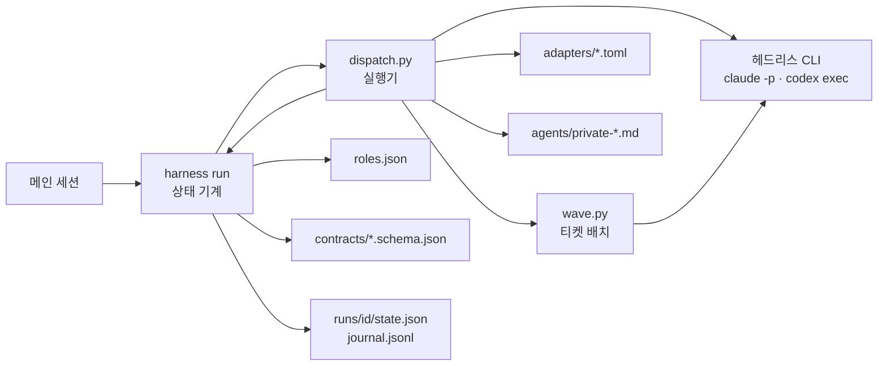
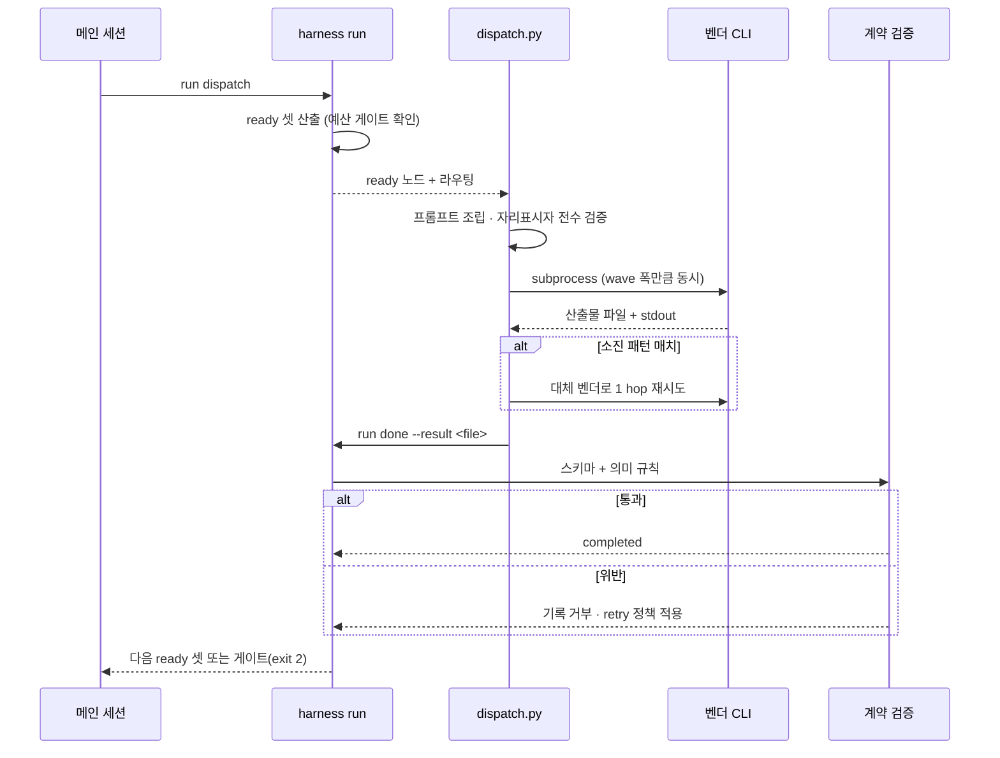

# ~/.harness 멀티에이전트 실행 계층 TDD

> 상태: **반영 완료** — [ADR 0005](../decisions/0005-dispatcher-execution-layer.md) · `orchestration/runner/` · `harness run dispatch|wave` · `harness test`
> 범위: `~/.harness` 의 기존 자산(agents 17개·skills 5개·private-feature 그래프 9노드·contracts 3개)을
> **실제로 병렬 실행되는 멀티에이전트로 전환**한다. 이식 원본은 `gitkraken-clone-app/.agent/orchestration` 이다.

## Background

`~/.harness` 는 멀티에이전트 파이프라인의 **선언**을 전부 갖췄다 — role 간접화(`roles.json`), 그래프(`orchestration/private-feature.json`), 산출물 계약(`contracts/*.schema.json`), 상태 기계(`bin/harness run`), 강등 사다리(`capabilities.md`), 런타임 예산 게이트(ADR 0004).

없는 것은 **실행**이다. `bin/harness run next` 는 "이 노드를 이렇게 부르세요" 라는 문자열을 출력하고 멈춘다. 실제 호출은 메인 세션이 손으로 한다 ([ADR 0003](../decisions/0003-graph-run-state-machine.md)).

같은 문제를 `gitkraken-clone-app` 은 이미 풀었다. 그 레포의 `.agent/orchestration` 에는 벤더 CLI 를 subprocess 로 직접 실행하는 러너(`run-graph.py` 837줄)와, 티켓 DAG 를 워크트리로 갈라 병렬 스폰하는 상위 실행기(`wave-graph.py` 460줄)가 돌고 있다.

이 문서는 **그 실행 계층만** `~/.harness` 로 옮기는 설계다.

- 근거 요구: 사용자 지시 — "gitkraken-clone-app 의 멀티에이전트를 적용하되, 현재 `~/.harness` 에 있는 것들을 멀티에이전트화"
- 참고 PRD: 없음 (하네스 내부 도구 변경)

## Overview

| 무엇을 | 왜 | 어떻게 |
|---|---|---|
| `~/.harness` 에 실행 계층(디스패처)을 신설한다 | 병렬 선언이 메인 세션의 규율에 의존해 실제로는 직렬화된다 | `orchestration/runner/dispatch.py` — ready 노드를 subprocess 로 동시 실행 |
| 벤더 호출을 TOML 선언으로 뺀다 | `invoke_command` 3분기 하드코딩이라 런타임 추가가 코드 변경이다 | `orchestration/runner/adapters/{claude,codex}.toml` |
| 노드 단위 소진 페일오버를 넣는다 | 예산 게이트는 사전 예측만 한다 — 실제 429 는 노드를 죽인다 | 어댑터 `[failover]` 정규식 감지 → 1 hop 전환 |
| 티켓 fanout 을 워크트리로 실행한다 | `expand_fanout` 이 노드는 복제하지만 워크트리는 안 만든다 | `orchestration/runner/wave.py` |
| 교차 벤더 검증을 기계 강제한다 | cross-review 는 `roles.json` 주석으로만 보장된다 | `harness lint` 에 `verifies` 검사 추가 |

**바꾸지 않는 것**: `bin/harness run` 은 그대로 상태 기계로 남는다. 계약 검증·journal·강등·재작업 루프백은 `~/.harness` 가 프로젝트보다 앞서 있는 부분이라 이식 대상이 아니다.

## Terminology

| 용어 | 정의 |
|---|---|
| 노드(node) | 그래프의 실행 단위 1개. `orchestration/private-feature.json#nodes[]` 의 한 원소 |
| role | 수행 역할. 구체 agent 를 가리지 않는 간접 층 (`roles.json#roles`) |
| 런타임(runtime) | 어느 LLM CLI 에서 도는가 — `claude` · `codex` · `host` |
| 등급(tier) | 그 런타임 안의 성능 등급 T1~T3. 런타임과 **별개 축** |
| 디스패처(dispatcher) | ready 노드를 실제로 subprocess 실행하는 신설 계층 |
| 어댑터(adapter) | 벤더 CLI argv 조립 규칙을 담은 TOML 선언 |
| wave | 의존이 해소돼 동시에 실행 가능한 노드/티켓 묶음 |
| fanout | 선행 산출물의 배열로 노드를 복제하는 동적 병렬 (`bin/harness:1118`) |
| 소진(exhaustion) | 벤더 쿼터·레이트리밋 고갈. 노드 실패의 한 종류 |

## Define Problem

### AS-IS

측정 근거는 전부 실제 파일이다.

**① 실행 주체가 없다.**
`bin/harness#cmd_run`(`bin/harness:1295`)의 `next` 는 `print_next`(`bin/harness:1252`)를 호출하고, 그 함수는 `invoke_command`(`bin/harness:172`)가 만든 문자열을 출력하고 리턴한다. 프로세스를 띄우는 코드가 없다.

```
실행 가능 (3개 — 동시 실행 가능):
  design-fe  (role design.fe, 시도 1/3)
    invoke   : { cat ~/.harness/agents/private-senior-fe.md; ... } | codex exec -m gpt-5.6-sol ...
```

"동시 실행 가능" 은 **사실 진술이 아니라 부탁**이다. 실제 동시성은 메인 세션이 한 메시지에서 여러 도구를 부르느냐에 달렸다.

**② 그래서 사후 감사 도구가 따로 있다.**
`hooks/private-wave-spawn-log.sh` 가 스폰 시각을 ledger 에 적재하고, `hooks/lib/wave-audit.py` 가 20초 간격으로 병렬/직렬을 판정한다. 그 파일 헤더가 문제를 그대로 적고 있다 — "직렬 스폰: 앞 에이전트 완료를 기다려 다음을 스폰 → 분 단위로 벌어짐". **감사 도구의 존재가 기계 강제의 부재를 증명한다.**

**③ fanout 이 워크트리를 만들지 않는다.**
`expand_fanout`(`bin/harness:1118`)은 티켓 배열로 자식 노드를 만들고 `depends_on` 을 노드 엣지로 옮긴다. 여기까지는 정확하다. 그러나 각 자식이 **어느 디렉토리에서 도는지**는 정하지 않는다. `print_next` 는 `cwd='<worktree>'` 라는 자리표시자를 그대로 출력한다(`bin/harness:1288`). 워크트리 격리는 `rules/00-core-directives.md` §5 와 `hooks/private-require-worktree-isolation.sh` 의 절차 강제뿐이다.

**④ 벤더가 코드에 박혀 있다.**
`invoke_command`(`bin/harness:172`)는 `claude`/`codex`/그 외 3분기다. 새 런타임을 붙이려면 이 함수를 고쳐야 한다. `adapters/` 디렉토리가 있지만 그건 **설정 파일 생성기**(`adapters/claude-code/build.py`)이지 실행 어댑터가 아니다.

**⑤ 예산 게이트는 사전 예측만 한다.**
`check_budget`(`bin/harness:1182`)은 ready 노드가 쓸 런타임의 누적 사용량이 80% 를 넘으면 디스패치를 막는다(ADR 0004). 하지만 **노드가 실제로 429 로 죽었을 때** 대체 벤더로 넘기는 경로는 없다. `run fail` 로 기록하고 재시도할 뿐이다.

**⑥ 교차 리뷰가 주석이다.**
`roles.json#bindings.cross-review._doc` 이 "작성자와 리뷰어를 다른 런타임에 둔다 … 같은 모델이 쓰고 검수하면 같은 맹점을 공유한다" 고 선언한다. 그러나 `bindings.cross-review` 를 편집해 `review.code` 를 `claude` 로 바꿔도 `harness lint` 는 통과한다. 검사 코드가 없다.

### TO-BE

| # | AS-IS | TO-BE |
|---|---|---|
| ① | ready 노드 문자열 출력 후 정지 | `harness run dispatch` 가 ready 셋을 ThreadPool 로 동시 실행 |
| ② | 병렬 여부를 사후 감사 | wave 폭이 실행 로그에 남는다 — 감사는 회귀 확인용으로 격하 |
| ③ | fanout 자식의 cwd 가 자리표시자 | 자식마다 `git worktree add` 로 전용 트리 확보 |
| ④ | `invoke_command` 3분기 | `adapters/*.toml` 선언. 러너에 벤더 이름 분기 0 |
| ⑤ | 사전 예측만 | 사전 예측 **유지** + 노드 실패 시 정규식 감지 → 1 hop 전환 |
| ⑥ | 주석 | `harness lint` 가 검증자·피검증자 런타임 동일 시 실패 |

## Architecture Benchmarking

동일 과제 — "선언된 DAG 를 사람 개입 지점을 남긴 채 무인 실행하고, 중단 후 재개한다".

| 제품/사례 | 해결 방식 | 참고할 패턴 | 미참고 사유 |
|---|---|---|---|
| **LangGraph** ([durable execution](https://vadim.blog/durable-execution-agents-that-survive-failure-and-resume-where-they-left-off) · [HITL 아키텍처](https://medium.com/data-science-collective/architecting-human-in-the-loop-agents-interrupts-persistence-and-state-management-in-langgraph-fa36c9663d6f)) | super-step 마다 checkpointer 가 StateSnapshot 저장. `interrupt()` 로 사람 승인 지점을 만들고 Command 로 재개 | **게이트 = 상태를 저장하고 멈추는 것**, 재개는 저장된 스냅샷에서. `~/.harness` 의 `awaiting-gate` + `state.json` 과 같은 모델 — 이 대응이 설계 방향의 근거다. 재개 시 **노드 전체가 재실행되므로 노드는 멱등해야 한다**는 제약도 그대로 가져온다 | 파이썬 런타임 내부에 그래프를 두는 방식은 안 쓴다. 여기서는 노드가 별도 CLI 프로세스라 프로세스 경계가 곧 체크포인트다 |
| **Temporal** ([vs Airflow](https://www.zenml.io/blog/temporal-vs-airflow) · [워크플로 프리미티브](https://www.kunalganglani.com/blog/temporal-workflow-engine-guide)) | 이벤트 소싱 — 모든 실행을 Event History 로 기록하고 워커 크래시 시 결정적 리플레이로 상태 복원. Activity 실패는 **그 Activity 만** 재시도 | `journal.jsonl` append 이벤트 모델이 이미 같은 형태다. "실패한 단위만 재시도" 를 노드 단위로 유지 — 워크플로 전체를 되감지 않는다 | 결정적 리플레이는 채택하지 않는다. LLM 노드는 비결정적이라 리플레이가 성립하지 않는다 — 그래서 **산출물 파일을 정본**으로 두고 리플레이 대신 캐시된 결과를 읽는다 |
| **Airflow** (동 출처) | 스케줄러가 DAG 정의를 읽어 ready 태스크를 executor 에 디스패치. 태스크 단위 `retries`·`retry_delay` | **스케줄러 / executor 분리**가 이 설계의 뼈대다 — `harness run`(ready 셋 판정) 과 `dispatch`(실행) 를 갈라 두는 근거 | 중앙 스케줄러 데몬은 안 둔다. 개인 하네스에 상주 프로세스는 과하다 — 세션이 부르는 1회성 CLI 로 충분하다 |
| **gitkraken-clone-app** (이식 원본, 사내 레포) | `run-graph.py` 가 어댑터 TOML 로 argv 를 조립해 subprocess 실행. `wave-graph.py` 가 티켓 DAG 를 워크트리로 갈라 러너를 프로세스 병렬 스폰 | 실행 계층 전부 — 어댑터 스키마·failover·워크트리 확보·게이트 exit 2·`--dry-run`/`--explain` | 상태·계약 계층은 안 가져온다. 그쪽은 `run.json` 매니페스트뿐이고, `~/.harness` 의 `state.json` + `semantic_checks` 가 더 강하다 |

> **관측 근거**: 프로젝트 `profiles.toml` 헤더가 `runs/` 실측을 인용한다 — 노드 1개 최소 소요 48초(p10 67초), 구성 선택으로 아낄 수 있는 최대치는 wave 당 약 72초. 즉 **판단 노드를 끼우면 절감분을 판단이 먹는다.** 프로필 해소를 LLM 이 아니라 결정적 테이블 조회로 두는 이유이고, 이 결론을 그대로 승계한다.

## Possible Solutions

### 방안 A — 프로젝트 러너를 통째로 복사

`run-graph.py`·`wave-graph.py`·`profiles.toml`·`adapters/` 를 `~/.harness/orchestration/` 아래로 그대로 옮기고, 그래프를 TOML 로 다시 쓴다.

가장 빠르다. 검증된 코드가 그대로 돈다. 그러나 **상태 저장소가 둘이 된다** — `runs/<id>/state.json`(harness) 과 `runs/<ts>-<wf>/run.json`(러너). 어느 쪽이 정본인지 모호해지고, 계약 검증(`validate_result`)·재작업 루프백(`--rework`)·강등 기록은 러너가 모르므로 우회된다. `~/.harness` 가 프로젝트보다 앞서 있는 부분을 버리는 선택이다.

### 방안 B — 상태 기계는 두고 실행 계층만 얹는다 ✅ **채택**

`bin/harness run` 은 지금 역할(ready 셋 산출·계약 검증·journal·게이트) 그대로 두고, 그 옆에 디스패처를 붙인다. 디스패처는 `run next` 가 여는 노드를 받아 subprocess 로 실행하고, 끝나면 `run done` 을 스스로 호출한다.

- 상태 정본은 `state.json` 하나로 남는다.
- 계약 검증이 자동 실행 경로에서도 그대로 작동한다 — 오히려 지금보다 강해진다 (사람이 건너뛸 수 없다).
- 프로젝트에서 가져오는 것은 **실행에 관한 것만**: 어댑터 TOML 스키마, failover 정규식, 워크트리 확보, dry-run/explain.
- ADR 0003 의 "CLI 가 LLM 을 부르지 않는다" 는 **부분 개정**이 된다 — 아래 참조.

### 방안 C — 그래프 포맷을 TOML 로 통일

JSON 그래프를 프로젝트와 같은 TOML 로 갈아엎어 두 레포가 같은 파일 포맷을 쓰게 한다.

미채택. 포맷 통일은 이득이 없다 — 두 레포는 그래프를 공유하지 않는다. 반면 `contracts/`·`lint`·`graph --sync` 가 전부 JSON 경로에 묶여 있어 변경 표면이 무의미하게 커진다. **지금 규모에 과한 방안이다.**

### ADR 0003 과의 관계 — 개정 범위

ADR 0003 은 "CLI 가 서브에이전트를 스폰하려면 런타임을 흉내내야 하고, 그 순간 '어느 런타임에서든 동일' 원칙이 깨진다" 고 적었다. 그 근거는 **Agent 툴이 메인 세션 전용**이라는 사실이다.

디스패처는 Agent 툴을 쓰지 않는다. **헤드리스 CLI(`claude -p`, `codex exec`)를 subprocess 로 부른다** — 메인 세션이 아니어도 되는 경로다. 따라서 원칙은 깨지지 않는다. 다만 "CLI 는 LLM 을 부르지 않는다" 는 문장은 더 이상 참이 아니므로, 구현 시 **ADR 0005 로 그 범위를 명시 개정**한다.

| ADR 0003 조항 | 개정 후 |
|---|---|
| 무엇을 실행할 차례인가 → `harness run` | 유지 |
| 실제 호출 → 메인 세션 | **메인 세션(Agent 툴) 또는 디스패처(헤드리스 CLI)** — 둘 다 허용 |
| 계약 검증 → `run done` | 유지. 디스패처도 같은 경로를 통과한다 |
| 상태·이력 기록 | 유지 |

## Detail Design

### 시스템 역할 경계

| 단위 | 역할 | 소유 데이터/책임 | 노출 인터페이스 | 의존 |
|---|---|---|---|---|
| `bin/harness run` | 상태 기계 | `runs/<id>/state.json` · `journal.jsonl` · 계약 검증 판정 | `new`·`next`·`status`·`done`·`fail`·`gate`·`budget` | `roles.json` · `contracts/` |
| `orchestration/runner/dispatch.py` **(신설)** | 실행기 | 프로세스 수명 · 프롬프트 파일 · 노드 로그 | `harness run dispatch` | `run next`(ready 셋) · 어댑터 |
| `orchestration/runner/adapters/*.toml` **(신설)** | 벤더 선언 | argv 조립 규칙 · failover 패턴 | 파일 (코드 아님) | 없음 |
| `orchestration/runner/wave.py` **(신설)** | 티켓 배치기 | 워크트리 경로 · 티켓별 브랜치 | `harness run wave <node>` | `dispatch.py` · git |
| `roles.json` | 라우팅 테이블 | role → runtime/tier · 예산 정책 | `harness role`·`graph` | 없음 |
| `contracts/*.schema.json` | 산출물 계약 | 스키마 + 의미 규칙 | `harness validate` | 없음 |
| `agents/private-*.md` | 페르소나 | 역할별 작업 규범 | 프롬프트 주입(`role_file`) | `rules/` |

**경계 원칙**: 디스패처는 **무엇을 실행할지 정하지 않는다.** ready 셋은 `run next` 가 준다. 반대로 상태 기계는 **어떻게 부르는지 모른다** — argv 는 어댑터가 만든다. 두 축을 섞으면 프로필 전환과 벤더 추가가 서로를 막는다.

### 인터페이스 시그니처

```
# 디스패처 — ready 셋을 실행하고 결과를 run done 으로 되먹인다
harness run dispatch [--run <run-id>] [--max-parallel N=4] [--dry-run]
                     [--no-failover] [--only <node,node>] [--explain]

# 티켓 wave — fanout 자식을 워크트리에 배치해 병렬 실행
harness run wave <fanout-node> [--worktree-root <path>] [--branch-prefix feat]
                               [--max-tickets N=0] [--allow-overlap] [--plan-only]
```

어댑터 TOML 스키마 (프로젝트 `adapters/README.md` 승계):

```toml
id = "claude"                                    # 필수 — roles.json#runtimes 의 키와 일치
base = ["claude", "-p", "--output-format", "json"]   # 필수 — 항상 붙는 인자
prompt_delivery = "stdin"                        # 필수 — stdin | argv
result = "stdout_envelope"                       # 필수 — stdout_envelope | out_file
envelope_result_key = "result"
envelope_cost_key   = "total_cost_usd"

[defaults]        # 노드가 값을 안 줬을 때
permission_mode = "dontAsk"

[flags]           # 노드 키 → argv 조각. {value} · {csv} · {repo_path}
model           = ["--model", "{value}"]
permission_mode = ["--permission-mode", "{value}"]
tools           = ["--allowedTools", "{csv}"]

[runtime]         # 러너가 채우는 슬롯
# out_file / cwd — codex 처럼 CLI 가 파일에 쓰는 벤더에서만 쓴다

[failover]
fallback_to = "codex"
fallback_model = "gpt-5.6-terra"
exhaustion_patterns = ["usage limit reached", "\"api_error_status\"\\s*:\\s*429", ...]

[failover.translate.permission_mode]             # 벤더 간 안전 의미 보존
dontAsk         = { key = "sandbox", value = "read-only" }
bypassPermissions = { key = "sandbox", value = "danger-full-access" }
```

`roles.json#runtimes[].invoke` 문자열은 **어댑터로 이관하고 제거**한다. 두 곳에 호출 규칙이 있으면 반드시 어긋난다.

### 프롬프트 조립 — 근거 없는 실행 차단

디스패처는 노드 프롬프트를 3부로 조립한다 (프로젝트 `run-graph.py#build_prompt` 승계).

| 섹션 | 내용 | 없으면 |
|---|---|---|
| `# 역할` | `agents/<agent>.md` 전문. role → agent 는 `roles.json` 이 해석 | 페르소나 없이 돎 |
| `# 작업` | 그래프 노드의 과업 + `--set` 자리표시자 치환 | — |
| `# 입력` | 선행 노드 산출물 **경로 목록** + "추측하지 마세요" | 노드가 추측으로 채운다 |
| `# 출력 계약` | `output_contract` 스키마 요약 + JSON 단독 출력 지시 | 파싱 실패 |

**실행 전 전수 검증**(프로젝트에서 실측으로 잡힌 두 사고를 그대로 승계):

1. 미치환 자리표시자가 하나라도 남으면 **노드를 하나도 실행하지 않고** 실패한다.
2. `--set` 으로 넘긴 파일 경로가 실재하지 않으면 실패한다. — 프로젝트 주석 기록: "없는 경로는 실패가 아니라 침묵이다. 노드는 '파일이 없다' 고만 적고 남은 입력으로 계속 쓴다. 산출물은 멀쩡해 보이는데 근거가 빠진 채 만들어진다 (wave 3 스펙 11건이 이 상태로 돌았다)."
3. 선행 노드 산출물(`runs/<id>/<dep>/result.json`)이 없으면 그 노드를 실행하지 않는다.

### 실패 경로·동시성·멱등

| 상황 | 동작 |
|---|---|
| 노드 비정상 종료 (exit≠0) | `run fail <node> --kind error` → `retry.on` 에 따라 `pending` 재개방 또는 `failed` |
| 산출물이 계약 위반 | `run done` 이 거부 → `contract_violation` 으로 기록. **조용히 통과 없음** |
| 벤더 소진 감지 | 어댑터 `exhaustion_patterns` 정규식이 stdout+stderr 에 매치 → `fallback_to` 로 **1 hop 만** 재시도. 미지원 키는 제거하고 **제거 사실을 journal 에 남긴다** |
| 소진 2회 (양쪽 다) | 노드 실패. 순환 재시도 금지 (hop 1 제한) |
| 타임아웃 | `timeout_sec` 초과 시 프로세스 kill → `on_failure` 정책 |
| 게이트 도달 | 디스패처는 대기하지 않는다. 상태를 `awaiting-gate` 로 두고 **exit 2** 로 종료 |
| 사전 예산 초과 | `check_budget` 이 이미 막는다 (ADR 0004). 디스패처는 `run next` 가 게이트를 반환하면 실행하지 않는다 |
| 워크트리 이미 존재 | **재사용한다.** `git worktree remove` 는 호출하지 않는다 — 사람의 미커밋 변경을 지울 수 있다 |
| 동시 워크트리 생성 | `git worktree add` 는 동시 실행 안전하지 않다 → **스폰 전에 순차 확보** |
| `state.json` 동시 쓰기 | 디스패처 프로세스 1개가 결과를 **직렬로 커밋**한다. 워커 스레드는 파일에 쓰지 않는다 |

**멱등 규칙 3가지**

1. 노드 재실행은 안전해야 한다 — LangGraph 의 재개 제약과 같다. 이전 시도의 산출물 파일을 **먼저 지우고** 실행한다. 남아 있으면 실패를 성공으로 오판한다.
2. 매니페스트는 **이번 실행이 쓴 것만** 믿는다. run-dir 은 재사용되므로 mtime 으로 판별한다 (프로젝트 `wave-graph.py#run_ticket` 승계).
3. `completed` 노드는 다시 열리지 않는다. 재작업은 `--rework` 로 **명시적으로만**.

### 노드 상태 전이

| 현재 상태 × 이벤트 | 다음 상태 | 거부 사유 |
|---|---|---|
| `pending` × 선행 전부 completed | ready 셋 진입 | — |
| `pending` × 디스패치 성공 + 계약 통과 | `completed` | — |
| `pending` × 디스패치 성공 + 계약 위반 | `pending`(재시도 남음) / `failed` | 결과를 기록하지 않는다 |
| `pending` × 소진 감지 | `pending` (대체 벤더 1 hop) | hop 소진 시 `failed` |
| `pending` × gate 선언 있음 + 실행 완료 | `awaiting-gate` | — |
| `awaiting-gate` × `--approve` | `completed` | — |
| `awaiting-gate` × `--reject` | `failed` + `retry.to` 재개방 | 사유 필수 |
| `pending` × fanout + 선행 산출물 도착 | `expanded` (자식 생성) | 자식 role 이 `fanout.roles` 밖이면 거부 |
| `expanded` × 자식 전원 completed | `completed` | — |
| `completed` × `--rework` 대상 | `pending` | 부모도 함께 되돌린다 |
| `failed` × 선행이 실패 | `skipped` | journal 에 사유 기록 |

### Component Diagram



### Sequence Diagram — 노드 1개의 수명



### 교차 벤더 검증 강제 (`harness lint` 추가 검사)

프로젝트는 `profiles.toml` 의 `verifies` 선언을 **로드 시점에** 검사한다 — 검증 프로필의 벤더가 대상과 같으면 실행 자체를 거부한다. 그 주석이 사고 기록을 담고 있다: "지금까지 claude 구현 → codex 검증은 관례였을 뿐이라 새 노드에서 조용히 깨졌다."

`~/.harness` 에는 `roles.json#bindings` 에 같은 의도가 주석으로만 있다. 이걸 기계 검사로 올린다.

```
roles.json#roles 에 verifies 필드 추가:
  "review.code": { "agent": "private-code-reviewer", "requires": "L0",
                   "verifies": ["implement.be", "implement.fe"] }

harness lint 신규 검사:
  각 프로파일에서 verifies 대상 role 과 검증 role 의 runtime 이 같으면 실패
```

`claude-only` 프로파일은 정의상 이 검사를 통과할 수 없다 — 그래서 **프로파일 단위 예외를 명시**한다 (`_cross_review_exempt: true` + 사유). 예외를 선언 없이 허용하면 검사가 무의미해진다.

## ERD

해당 없음 — DB 스키마 변경이 없다. 상태는 파일(`runs/<id>/state.json`·`journal.jsonl`)에 남는다.

## Testing Plan

`~/.harness/tests/` 가 이미 있다. 서드파티 의존 0(stdlib) 원칙을 유지한다.

| 레벨 | 범위 | 핵심 케이스 |
|---|---|---|
| 단위 — 어댑터 | argv 조립 | 필수 키 누락 시 로드 실패 / `{csv}`·`{repo_path}` 치환 / 미지원 키를 노드가 주면 실행 전 실패 / `fallback_to` 가 없는 벤더면 로드 실패 / 자기 자신을 가리키면 로드 실패 |
| 단위 — 프롬프트 | 조립·검증 | 미치환 자리표시자 잔존 시 **0개 노드 실행** / `--set` 파일 부재 시 실패 / 선행 산출물 부재 시 그 노드만 미실행 |
| 단위 — failover | 소진 감지 | 각 `exhaustion_patterns` 가 실제 관측 문자열에 매치 (특히 `"api_error_status":429`, `is at capacity`) / hop 1 초과 금지 / 키 제거가 journal 에 남는가 |
| 단위 — 상태 전이 | 위 전이 표 전수 | 계약 위반이 `completed` 로 가지 않는가 / `--rework` 가 부모도 되돌리는가 / 게이트가 단독 wave 인가 |
| 단위 — wave 배치 | 티켓 소유 | 같은 wave 소유 경로 교집합 시 **실행 전 차단** / 쓰기 워크플로우에 `--no-worktree` 거부 / 기존 워크트리 재사용 시 remove 미호출 |
| 통합 — dry-run | LLM 0회 | `private-feature.json` 9노드가 `--dry-run` 통과 / wave 폭 분포가 설계와 일치 / `--explain` argv 가 전환 전후 동일 |
| 통합 — lint | 정합 | `verifies` 교차 벤더 검사 / `_routing` 드리프트 / 어댑터 id ↔ `roles.json#runtimes` 키 일치 |
| 시나리오 | 실측 1회 | 읽기 전용 노드 1개를 실제 실행해 산출물이 계약을 통과하는지 확인 (비용 발생 — 승인 후) |

**핵심 실패 경로 시나리오** (해피 패스만으로는 미완성):

1. 게이트 도달 → 프로세스 종료(exit 2) → 승인 → 같은 run-id 로 재개 → 이어서 실행되는가
2. 노드 A 실패 → 후행 B 가 `skipped` 로 journal 에 사유와 함께 남는가 (암묵적 축소 금지)
3. claude 소진 → codex 로 전환 → `output_schema` 미지원으로 제거 → **제거 사실이 로그에 남는가**
4. 워크트리에 사람의 미커밋 변경이 있는 상태에서 wave 재실행 → 변경이 보존되는가
5. 디스패처를 중간에 kill → `state.json` 이 손상되지 않고 `run status` 가 정확한가

## Release Scenario — 무중단 전환

현행 파이프라인(`/private-feature` 수동 실행)을 **한 번도 못 쓰게 만들지 않고** 전환한다. 각 단계는 독립 배포이고 롤백 지점을 갖는다.

| 단계 | 내용 | 전환 조건 | 롤백 |
|---|---|---|---|
| **1. 어댑터 도입 (비활성)** | `adapters/*.toml` 추가 + `harness lint` 검사. 실행 경로는 건드리지 않는다 | lint 통과 · `invoke_command` 출력이 어댑터 조립 결과와 **문자열 동일** | 파일 삭제 (아무도 안 읽는다) |
| **2. `--explain` 대조** | 디스패처를 추가하되 실행은 안 한다. argv 만 출력 | 9노드 전부 현행 `invoke` 와 diff 0 | 동일 |
| **3. 읽기 전용 노드만 자동** | `run dispatch --only <읽기 노드>` 로 opt-in. 쓰기 노드는 계속 수동 | 산출물이 계약 통과 · 비용이 예상 범위 | `--only` 를 안 쓰면 현행 그대로 |
| **4. 쓰기 노드 + 워크트리** | `run wave` 로 fanout 자식 실행. 소유 교집합 차단 활성 | 워크트리 격리 검증 · 사람 미커밋 변경 보존 확인 | `--no-worktree` 금지 유지 · 수동 복귀 |
| **5. 기본값 전환** | `/private-feature` 스킬이 `run next` 대신 `run dispatch` 를 부른다. ADR 0005 기록 | 1~4 전부 통과 + 실측 run 1회 완주 | 스킬 문서를 되돌리면 즉시 수동 복귀 (**엔진은 그대로 둔다**) |

- 1~3 단계는 **아무도 새 경로를 읽지 않으므로** 파일 되돌리기만으로 안전하다.
- 5단계 롤백이 스킬 문서 1개 수정인 것이 이 순서의 핵심이다 — 엔진과 진입점을 분리했기 때문이다.

데이터 마이그레이션은 해당 없음 — 기존 `runs/` 는 포맷이 바뀌지 않고, 새 필드(`vendor`·`failover`)는 선택적으로 추가된다.

## Open Questions

| # | 질문 | 왜 지금 못 정하나 |
|---|---|---|
| 1 | `profiles.toml` 을 별도로 둘 것인가, `roles.json#bindings` 에 흡수할 것인가 | 프로젝트는 profile(실행 예산) 과 role(과업) 을 분리했고, `~/.harness` 는 role 하나에 둘 다 실었다. 흡수가 단순하지만 **모델만 올리려는데 tier 의미가 따라오는** 결합이 생긴다. 실제 전환 노드 수(9개)로는 판단 근거가 부족하다 |
| 2 | 워크트리 루트 경로 | 프로젝트는 `<repo>-worktrees/`. `~/.harness` 는 대상 레포가 가변이라 어디에 둘지 정해야 한다 — `rules/00-core-directives.md` §5 와 `hooks/private-require-worktree-isolation.sh` 가 기대하는 경로 규약을 먼저 확인해야 한다 |
| 3 | `host` 런타임의 어댑터 표현 | `host` 는 "현재 세션 런타임 그대로" 라 subprocess 로 부를 대상이 없다. 어댑터 없이 **디스패처 대상에서 제외**하고 수동 경로로 남기는 안이 유력하다 |
| 4 | 비용 집계 단위 | claude 는 봉투에 `total_cost_usd` 가 있지만 codex 는 없다. 노드별 비용을 `state.json` 에 넣을지, 매니페스트로 뺄지 |
| 5 | `claude-only` 프로파일의 교차 리뷰 예외 | 검사를 넣으면 이 프로파일이 구조적으로 위반한다. 예외 선언 방식(`_cross_review_exempt`)이 최선인지 확정 필요 |

## Document History

| 날짜 | 변경 내용 |
|---|---|
| 2026-08-27 | 최초 작성 — gitkraken-clone-app 실행 계층 이식 설계 |
| 2026-08-27 | 구현 완료. Open Questions 5건 확정: ①`profiles.toml` 신설 안 함(`roles.json#roles[].exec` 로 흡수) ②워크트리 루트 `<repo-parent>/<repo>-worktrees` ③`host` 는 디스패처 제외 ④비용은 `state.json` 노드별 + `run status` 합산 ⑤`claude-only`·`portable` 에 `_cross_review_exempt` 명시. 설계에 없던 발견 2건: `portable` 프로파일도 교차 검증 구조적 불가(검사 도입으로 처음 드러남), `__pycache__` 가 rubric A 를 거짓 실패시킴 |
