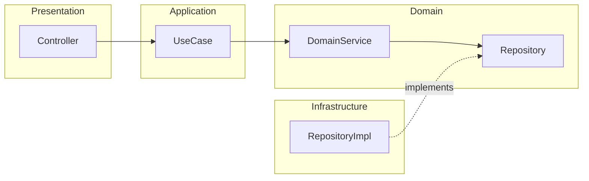
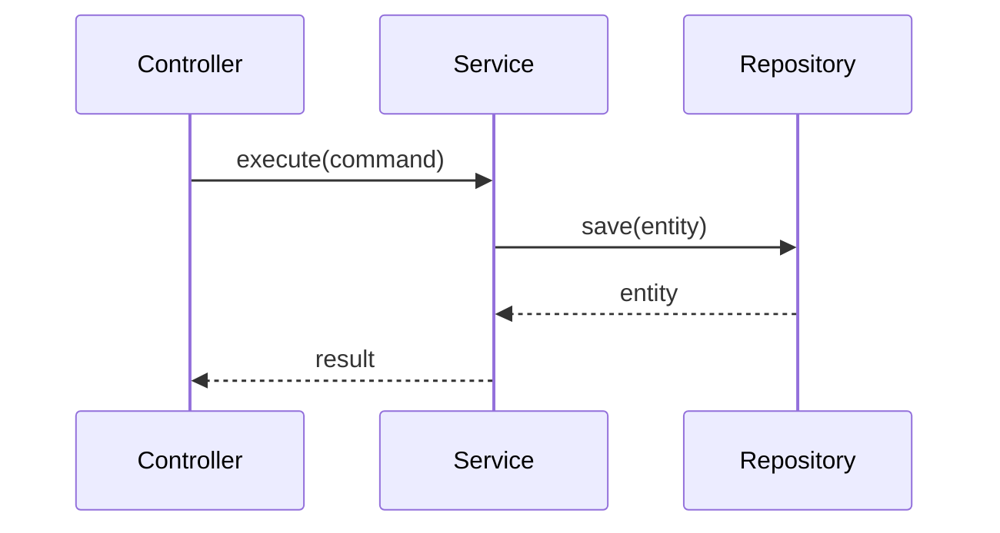
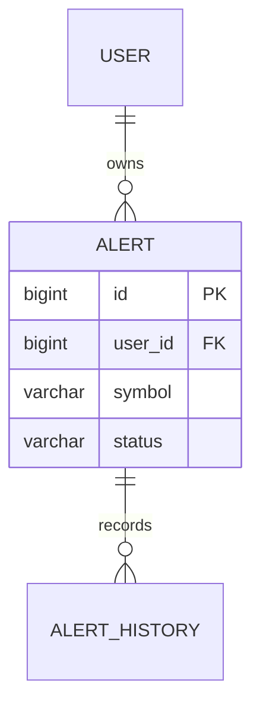
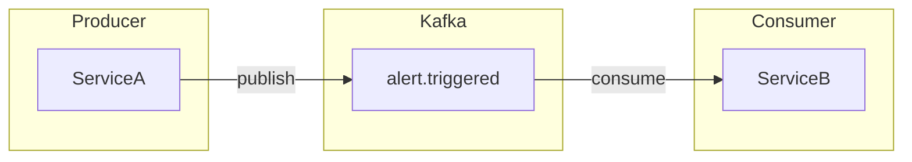

# Mermaid 다이어그램 가이드

## 기본 규칙

- flowchart/graph는 항상 `LR` 방향을 사용합니다. TB/TD는 금지합니다.
- 노드는 15개 이하로 유지합니다. 초과 시 `subgraph`로 그룹핑합니다.
- `&` 체이닝은 금지합니다. 각 연결을 별도 라인으로 작성합니다.

## PNG 변환

Mermaid를 렌더링하지 못하는 곳에 붙일 때는 PNG로 변환합니다.

```bash
mmdc -i input.mmd -o output.png -w 4800 -b white -t default -s 4
```

- `-w 4800`: 가로 4800px (고해상도 — 확대해도 선명)
- `-b white`: 흰 배경 (문서 첨부 시 가독성)
- `-s 4`: 스케일 4배

## 다이어그램 유형별 예시

### Component Diagram



### Sequence Diagram



### ERD



### Kafka Event Flow


