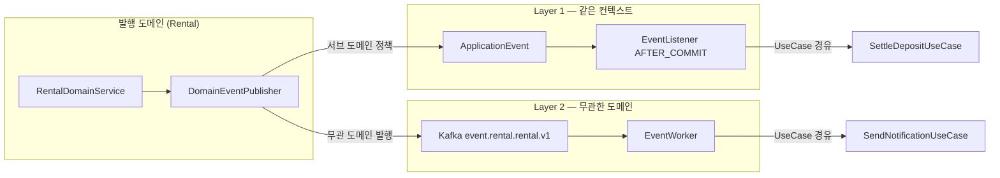

# [개인] BE 아키텍처 규칙 — 이벤트 기반 아키텍처 (Event-Driven Architecture)

개인 프로젝트용 BE 시스템 아키텍처 규칙. 코드 라인 컨벤션([private-be-code-convention](./private-be-code-convention.md))과 분리해, **도메인 간 결합을 어떻게 끊을 것인가(이벤트 발행/구독 구조)** 를 다룬다. `private-architect`가 구조 설계 기준으로, `private-senior-be`가 TDD 설계 기준으로, `private-be-implementer`가 구현 기준으로, `private-code-reviewer`가 검수 기준으로 공통 참조한다 (SSOT).

## 원칙 — 왜 이벤트인가

- **직접 호출 대신 이벤트로 결합을 끊는다.** 특정 이벤트(상태 전이·생성·삭제)가 발생하면, 그 이벤트에 관심 있는 도메인·데이터가 **이벤트를 구독해 자신의 비즈니스를 스스로 처리**한다 (연관 데이터 삭제, 알림 발송, 정책 적용 등).
- 이벤트 발행자는 **누가 구독하는지 몰라야 한다.** "대여가 반납되면 A도 하고 B도 하고…"를 UseCase에 나열하지 않는다 — 반납 도메인은 `RentalReturned` 이벤트만 발행하고, 관심 있는 쪽이 각자 반응한다.
- 이벤트는 **부수 효과(side-effect)를 분리**하는 도구다. 핵심 비즈니스(반납 처리 자체)는 원 트랜잭션에서 끝내고, 파생 처리(알림·통계·연관 정리)는 이벤트로 뺀다.

## 2단계 레이어 모델 (핵심)

이벤트는 **관심 도메인의 거리**에 따라 두 레이어로 나뉜다. 발행 지점에서 어느 레이어인지 먼저 판단한다.

| 레이어 | 전달 수단 | 구독자 범위 | 트랜잭션 관계 |
|---|---|---|---|
| **Layer 1 — 도메인 내부 이벤트** | Spring `ApplicationEvent` | **같은 앱·같은 바운디드 컨텍스트**의 연관 서브 도메인·정책 | 같은 트랜잭션일 필요는 없으나 같은 프로세스 |
| **Layer 2 — 도메인 간 이벤트** | Kafka 토픽 | **아예 무관한 도메인**(별도 바운디드 컨텍스트/서비스) | 트랜잭션 완전 분리, 비동기 |

### 레이어 판단 기준

| 질문 | Yes → Layer 1 | Yes → Layer 2 |
|---|---|---|
| 구독자가 발행자와 같은 앱·같은 배포 단위인가 | ✅ ApplicationEvent | — |
| 구독자가 발행 도메인의 서브 도메인/연관 정책인가 (같은 컨텍스트) | ✅ ApplicationEvent | — |
| 구독자가 발행 도메인과 무관한 별도 도메인/서비스인가 | — | ✅ Kafka |
| 프로세스가 죽어도 이벤트가 유실되면 안 되는가 (내구성 필요) | — | ✅ Kafka |
| 재처리·다중 소비자·순서 보장이 필요한가 | — | ✅ Kafka |

- **판단이 애매하면 Layer 1로 시작**한다. 나중에 도메인이 실제로 분리되거나 내구성이 필요해지면 Layer 2로 승격한다 (과한 선제 Kafka 도입 금지).
- 하나의 사건이 **두 레이어 모두**를 필요로 할 수 있다 — 같은 도메인 정산(Layer 1) + 무관한 알림 서비스(Layer 2). 이때 발행 지점은 하나(도메인 이벤트)이고, 어댑터가 각 레이어로 팬아웃한다.

## Layer 1 — Spring ApplicationEvent (도메인 내부)

**용도**: 같은 도메인이지만 관심사가 갈리는 서브 도메인·정책·연관 데이터를 원 트랜잭션에서 떼어 처리한다. "같은 트랜잭션으로 묶을 필욘 없지만 이 사건에 관심이 있는" 도메인.

### 규칙

- 발행: DomainService가 `DomainEventPublisher` interface(domain)로 호출 → 구현체(`SpringDomainEventPublisher`, infrastructure)가 `ApplicationEventPublisher`로 전달. **UseCase·DomainService에 `ApplicationEventPublisher`를 직접 주입하지 않는다** — domain interface 뒤로 숨긴다.
- 구독: **presentation layer**의 `@TransactionalEventListener(phase = AFTER_COMMIT)` — 원 트랜잭션 커밋 이후 실행해, 커밋 안 된 상태를 파생 처리가 보는 사고를 막는다. 리스너는 **UseCase를 경유**한다 (리스너에 비즈니스 로직 금지).
- 서브 도메인 간 비동기가 필요하면 `@Async` + `@Retryable` — 파생 처리 실패가 원 흐름을 막지 않는다.
- 파생 처리는 **자신의 트랜잭션**을 새로 연다 (`REQUIRES_NEW` 성격). 원 트랜잭션에 얹지 않는다.

```kotlin
// domain — 발행 계약 (같은 interface를 Layer 1/2 구현이 나눠 가진다)
interface DomainEventPublisher {
    fun publishAll(events: List<DomainEvent>)
}

// presentation/listener/RentalReturnedEventListener.kt — Layer 1 구독
@Component
class RentalReturnedEventListener(
    private val settleDepositUseCase: SettleDepositUseCase,   // 같은 도메인 서브 정책
) {
    @Async
    @TransactionalEventListener(phase = TransactionPhase.AFTER_COMMIT)
    fun handle(event: RentalReturnedEvent) {
        settleDepositUseCase.execute(event.toCommand())
    }
}
```

## Layer 2 — Kafka 토픽 (도메인 간)

**용도**: 발행 도메인과 **아예 무관한 도메인**이 이 사건에 관심을 가진다. 구독 측은 이벤트를 받아 연관 정책·데이터·비즈니스를 독립적으로 처리한다 (예: 알림 서비스, 통계 도메인, 외부 연동).

### 규칙

- 발행: `DomainEventPublisher`의 Kafka 구현체(`KafkaDomainEventPublisher`, infrastructure)가 `KafkaTemplate`으로 토픽에 발행. **서비스 코드에서 `KafkaTemplate` 직접 사용 금지.**
- 구독: **presentation layer**의 `~EventWorker.kt` (`@KafkaListener`) → `ConsumerRecord<String, String>` 금지, DTO 직접 매핑 → **UseCase 경유**. 상세 코드 규칙은 [private-be-code-convention](./private-be-code-convention.md) "Kafka Consumer".
- **멱등 필수** — `eventId` 기반으로 중복 수신을 정상 시나리오로 처리한다. Kafka는 at-least-once다.
- **토픽 네이밍은 메시지 유형(fan-out 이벤트 vs 목적 메시지)으로 갈린다** — 아래 "토픽 네이밍" SSOT. 스키마·파티션·키·보존 설계는 [private-kafka-convention](./private-kafka-convention.md)이 SSOT. 파괴적 스키마 변경은 새 버전 토픽.

### 토픽 네이밍 — 메시지 유형 2종 (SSOT)

토픽은 **전달 형태**에 따라 두 종류로 나뉜다. 접두사가 유형을 드러낸다 — 접두사만 보고 fan-out인지 point-to-point인지, 이벤트(사실)인지 목적(작업)인지 판단할 수 있어야 한다.

| 유형 | 형식 | 전달 | 의미 | 컨슈머 |
|---|---|---|---|---|
| **도메인 이벤트** | `event.{domain}.{sub-domain}.v{N}` | **1:n fan-out** | "무슨 일이 일어났다" (과거형 사실) | 관심 있는 여러 컨텍스트가 **각자 고유 `groupId`**로 독립 구독 |
| **목적 메시지** | `queue.{action}.v{N}` | **1:1 point-to-point** | "이 작업을 처리하라" (특정 목적) | 단일 소비자(단일 `groupId`)가 작업을 소비 |

**버전 접미사 `.v{N}`은 두 형식 모두 필수**다 (생략 불가). 최초 토픽이 `.v1`, 파괴 변경(필드 제거·타입 변경·의미 변경) 시 `.v{N+1}` 토픽을 새로 만들어 소비자 이관 후 구 토픽을 폐기한다. 상세는 [private-kafka-convention](./private-kafka-convention.md).

**도메인 이벤트 — `event.{domain}.{sub-domain}.v{N}`**

- 발행 도메인에 무관한 여러 도메인이 **동시에** 관심을 가질 수 있는 사건. 발행자는 구독자를 모른다.
- `{domain}` = 발행 바운디드 컨텍스트. `{sub-domain}` = **그 도메인 하위에 존재하는 서브 도메인(집계 루트)** — 사건의 종류(생성·수정·삭제·상태 전이)가 **아니다**. 예: `event.product.brand-product.v1` (product 도메인의 brand-product 서브 도메인). 도메인이 단일 집계뿐이면 `event.order.order.v1`처럼 반복될 수 있다.
- **무슨 일이 일어났는지(생성/수정/삭제/상태 전이)는 토픽명이 아니라 payload에만 담는다.** 한 서브 도메인의 모든 생명주기 이벤트가 **같은 토픽**으로 가고, payload가 종류를 구분한다 — sealed 타입 등 그 서브 도메인의 이벤트를 하나의 shape로 표현한다. (토픽을 이벤트 종류마다 쪼개지 않는다.)
- **라우팅 키(메시지 key) = 그 서브 도메인 엔티티의 PK.** 예: `event.product.brand-product.v1`의 key는 brand-product의 PK. 같은 엔티티 인스턴스의 이벤트가 한 파티션에 모여 **순서가 보장**된다.
- 여러 컨슈머 그룹이 붙어도 각자 전량 수신(팬아웃) — 컨텍스트별 `groupId` 분리 필수 (같은 그룹이면 파티션을 나눠 가져 서로 메시지를 뺏는다).
- payload는 과거형 사실. 공통 필드 `eventId`·`occurredAt` 포함. **명령형(`Command`) 의미 금지** — 그건 목적 메시지다.

**목적 메시지 — `queue.{action}.v{N}`**

- **하나의 특정 목적**을 처리하기 위해 지정된 소비자에게 보내는 작업 지시. 발행자는 "무엇을 시킬지" 안다.
- `{action}` = 처리할 작업. 예: `queue.send-email.v1`, `queue.generate-thumbnail.v1`, `queue.settle-payout.v1`.
- **단일 컨슈머 그룹**이 소비 — 여러 인스턴스는 파티션을 나눠 부하 분산(워크 큐)하되, 논리적으로 한 소비자다. 팬아웃이 필요하면 그건 목적 메시지가 아니라 도메인 이벤트다.
- 라우팅 키는 순서·분산 기준으로 정한다(작업 대상 엔티티 PK 등). 명령형 payload 허용(작업 파라미터). 멱등은 여기서도 필수.

> **유형 선택 기준**: "이 사건에 관심 있는 쪽이 여럿이고 발행자가 그들을 몰라야 하는가" → `event.*` (fan-out). "특정 작업 하나를 지정된 곳에서 처리시키는가" → `queue.*` (point-to-point). 애매하면 `event.*`로 시작한다 — 나중에 소비자가 늘어도 팬아웃이 성립한다.

- 스키마·파티션·키·보존 정책 상세는 [private-kafka-convention](./private-kafka-convention.md)을 따른다.

```kotlin
// presentation/rental/worker/RentalEventWorker.kt — Layer 2 도메인 이벤트 구독 (무관한 알림 도메인)
@Component
class RentalEventWorker(
    private val sendReturnNotificationUseCase: SendReturnNotificationUseCase,
) {
    // 리스너 파라미터는 서브 도메인의 단일 sealed 베이스(RentalEvent) — 토픽이 아니라 payload 변이가 종류를 구분
    @KafkaListener(topics = ["event.rental.rental.v1"], groupId = "notification-rental")  // key=rental PK, 1:n fan-out
    fun consume(event: RentalEvent) {
        when (event) {
            is RentalEvent.Returned -> sendReturnNotificationUseCase.execute(event.toCommand())  // 멱등은 UseCase 내부
            else -> Unit  // 이 컨슈머가 관심 없는 변이는 no-op
        }
    }
}
```

## 이벤트 흐름



## 도메인 이벤트 적재 규칙 (발행 공통)

- 도메인 이벤트는 Entity 내부 `@Transient domainEvents` 리스트에 적재 → DomainService가 `pullDomainEvents()`로 꺼내 `DomainEventPublisher.publishAll()`로 발행한다. 이 규칙은 Layer 1/2 공통이다.
- **한 서브 도메인의 생명주기 이벤트는 단일 sealed 타입 `{SubDomain}Event`로 표현**하고, 종류(생성·상태 전이·취소 등)는 그 sealed의 변이(`Confirmed`/`Cancelled`/`Returned`…)로 나눈다 — 한 서브 도메인 토픽(`event.{domain}.{sub-domain}.v{N}`)이 이 단일 shape를 실어 나른다. 변이별로 이벤트 클래스·토픽을 쪼개지 않는다. 공통 필드로 `eventId`(멱등 키)·`occurredAt`(`ZonedDateTime`)를 포함한다.
- **JSON 다형 역직렬화**: 프로듀서가 타입 헤더를 끄므로(`ADD_TYPE_INFO_HEADERS=false`) sealed 판별은 **payload 프로퍼티**로 한다 — `@JsonTypeInfo(include = PROPERTY/EXISTING_PROPERTY, property = "eventType")` + `@JsonSubTypes`. 컨슈머는 sealed 베이스를 파라미터로 받아 `when`으로 관심 변이만 처리(나머지 no-op).
- 발행자는 구독자를 알지 못한다 — 이벤트에 "무엇을 하라"가 아니라 "무슨 일이 일어났다"(과거형)를 담는다: `RentalEvent.Returned` ✅ / `SendNotificationCommand` ❌.

## 실패·멱등·순서

| 관심사 | Layer 1 (ApplicationEvent) | Layer 2 (Kafka) |
|---|---|---|
| 전달 보장 | 프로세스 내 — 앱 다운 시 유실. 유실 불가면 Layer 2로 | at-least-once, 브로커 보존 |
| 멱등 | 파생 처리가 재실행돼도 안전하게 (upsert·상태 가드) | `eventId` 중복 체크 필수 |
| 순서 | 발행 순서 보장 안 됨 — 순서 의존 설계 금지 | 같은 key는 파티션 내 순서 보장 ([private-kafka-convention](./private-kafka-convention.md)) |
| 재시도 | `@Retryable` + 최종 실패 로깅 | consumer 재처리 + DLQ(필요 시) |
| 롤백 | 원 트랜잭션과 분리 — 파생 실패가 원 흐름 롤백하지 않음 | 동일 |

- **해피 패스만 있는 이벤트 설계는 미완성** — 중복 수신·부분 실패 시 상태를 설계 문서([private-tdd](./private-tdd.md) "실패 경로·동시성·멱등")에 명시한다.

## 공용 컨텍스트 역참조 금지 — 결제 완료 → 주문 확정 (핵심)

**의존 방향은 업무/주문 컨텍스트 → 공용 컨텍스트다. 역방향 금지.** 결제(payment)·알림 같은 **공용 컨텍스트가 자기를 사용하는 주문/업무 컨텍스트(booking·goods·ticketing·recruitment 등)를 역참조하지 않는다.** payment의 domain·infrastructure가 다른 컨텍스트의 DomainService/Repository를 주입·호출하면 의존 화살표가 뒤집힌다("공용·하위" → "구체·상위").

### 금지 — 동기 디스패치 허브 (`OrderConfirmationGateway`류)

payment 인프라가 `when(orderType)`으로 여러 주문 컨텍스트의 DomainService를 호출해 확정/취소를 디스패치하는 중앙 허브를 두지 않는다.

```kotlin
// ❌ BAD — payment 인프라가 4개 주문 컨텍스트를 역참조 (의존 역전 + OCP hotspot)
@Component
class OrderConfirmationGatewayImpl(
    private val bookingDomainService: BookingDomainService,       // payment → booking 역참조
    private val goodsDomainService: GoodsDomainService,           // payment → goods
    private val ticketingDomainService: TicketingDomainService,   // payment → ticketing
    private val recruitmentDomainService: RecruitmentDomainService,
) : OrderConfirmationGateway {
    override fun confirm(orderType: OrderType, orderId: Long, paymentId: Long) {
        when (orderType) {                                        // OrderType 추가마다 이 클래스 수정 (OCP 위반)
            OrderType.BOOKING -> bookingDomainService.confirmBooking(orderId, paymentId)
            // ...
        }
    }
}
```

문제: ① 의존 방향 역전(공용 payment → 구체 주문 컨텍스트) ② OrderType 추가마다 중앙 클래스·생성자 수정(OCP 위반) ③ payment 배포/컴파일 단위가 모든 주문 컨텍스트에 전이 의존 ④ `Gateway`(외부 시스템 호출 전용)를 **내부 컨텍스트 재호출로 위장** — 컨벤션 위반.

### 대신 — payment가 이벤트 발행, 각 주문 컨텍스트가 자기 확정 (Layer 2 Kafka)

- payment는 payment 서브 도메인 토픽 `event.payment.payment.v1`에 **발행만** 한다 — 누가 구독하는지 모른다. key = payment PK. payload는 payment 생명주기를 담은 **단일 sealed shape**(`PaymentEvent` — `Confirmed`/`Cancelled`/… 변이, 공통 필드 `eventId`·`occurredAt` + `orderType`·`orderId`·`paymentId`)로, 확정·취소는 **payload 변이**로 구분한다 (토픽을 종류별로 쪼개지 않는다 — 위 "토픽 네이밍").
- **Layer 2(Kafka) 선택 근거**: 결제 완료가 유실되면 "결제됨 + 주문 미확정"(돈만 받고 서비스 미제공)이 되어 **내구성이 필수**다 → [레이어 판단 기준](#레이어-판단-기준)의 "내구성 필요 → Kafka". 여러 주문 컨텍스트가 각자 고유 `groupId`로 팬아웃 구독한다.
- **단일 shape 유지**: 한 서브 도메인 토픽의 payload는 그 서브 도메인 이벤트의 단일 sealed shape로 통일한다 — 서로 무관한 관심사(예: 알림)를 별도 토픽에 얹으려고 payment 토픽에 이질적 payload를 섞으면 `FAIL_ON_UNKNOWN_PROPERTIES` 역직렬화 충돌이 난다. 알림처럼 다른 서브 도메인/관심사는 자기 토픽을 구독하거나, 이 토픽의 sealed 변이를 그대로 소비한다.
- 각 주문 컨텍스트가 **자기** `presentation/<context>/worker/PaymentEventWorker`(`@KafkaListener`, 컨텍스트별 고유 `groupId`)로 구독 → sealed 변이(Confirmed/Cancelled) + `orderType` 필터 → 자기 확정 UseCase 경유 → `eventId` 기반 멱등(이미 확정된 주문 재수신은 no-op). 여러 컨텍스트가 같은 토픽을 구독하므로 컨슈머 그룹을 컨텍스트별로 분리해야 팬아웃이 성립한다(같은 그룹이면 파티션을 나눠 가져 서로 메시지를 뺏는다).
- 이 방향이면 payment는 아무 주문 컨텍스트도 모르고(의존 0), 각 주문 컨텍스트가 payment의 **이벤트 계약**에만 의존한다(방향 정상). 새 OrderType 추가 시 payment 무수정 — 새 컨텍스트가 구독만 추가(OCP 준수).
- **트레이드오프 인지**: 동기 확정(원 트랜잭션 내 즉시)의 강일관성을 최종일관성으로 바꾼다 — "결제됨→확정" 사이 짧은 창이 생기므로, 확정 UseCase 멱등 + 조회 경로의 중간 상태 처리를 설계 문서 "실패 경로·동시성·멱등"에 명시한다.

> **Gateway 재확인**: `~Gateway`는 **외부 시스템 호출 전용**(외부 API·SMS·이메일·PG·푸시)이다. 내부 컨텍스트 간 협력을 Gateway로 위장하지 않는다 — 협력은 이벤트(+ FK id 보유)로 한다.

## 안티패턴 (private-code-reviewer p1)

- UseCase/DomainService에 `ApplicationEventPublisher`·`KafkaTemplate` 직접 주입 (→ `DomainEventPublisher` interface 경유)
- 이벤트 리스너·EventWorker에 비즈니스 로직 작성 (→ UseCase 경유)
- 무관한 도메인을 ApplicationEvent로 결합 (→ Layer 2 Kafka)
- 같은 컨텍스트 서브 도메인을 근거 없이 Kafka로 분리 (→ 과한 인프라, Layer 1로)
- 이벤트에 명령형 의미(`Command`) 부여 (→ 과거형 사실 `~Event`)
- Layer 2 구독에 멱등 처리 누락
- `@TransactionalEventListener` 없이 커밋 전 파생 처리 실행 (→ AFTER_COMMIT)
- **공용 컨텍스트(payment·notification 등)가 주문/업무 컨텍스트를 역참조** — `OrderConfirmationGateway`류 `when(orderType)` 동기 디스패치 허브 (→ payment가 이벤트 발행, 각 주문 컨텍스트가 자기 EventWorker로 확정)
- **내부 컨텍스트 협력을 `~Gateway`로 위장** — Gateway는 외부 시스템 전용 (→ 이벤트 + FK id)

## 참고 영상

- https://www.youtube.com/watch?v=b65zIH7sDug
- https://www.youtube.com/watch?v=DY3sUeGu74M&t=110s

## 참고 문서

- [private-be-code-convention](./private-be-code-convention.md) — 레이어 책임·Kafka Consumer·DomainEventPublisher 코드 규칙
- [private-kafka-convention](./private-kafka-convention.md) — 토픽·스키마·멱등 (Layer 2 SSOT)
- [private-tdd](./private-tdd.md) — 설계 문서에 이벤트 흐름·실패 경로 명시
- [mermaid](./mermaid.md) — 다이어그램 규칙 (flowchart LR)
